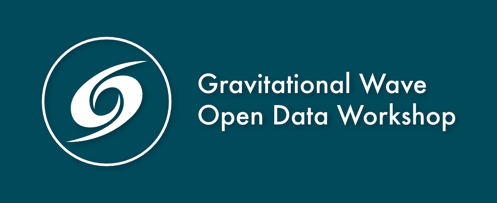
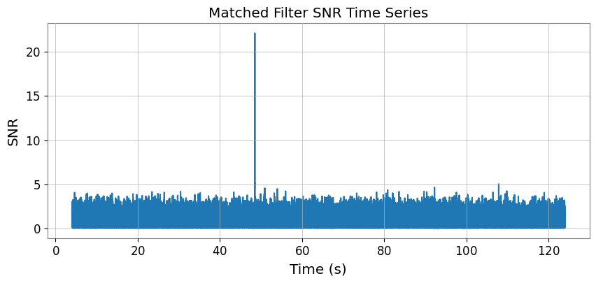
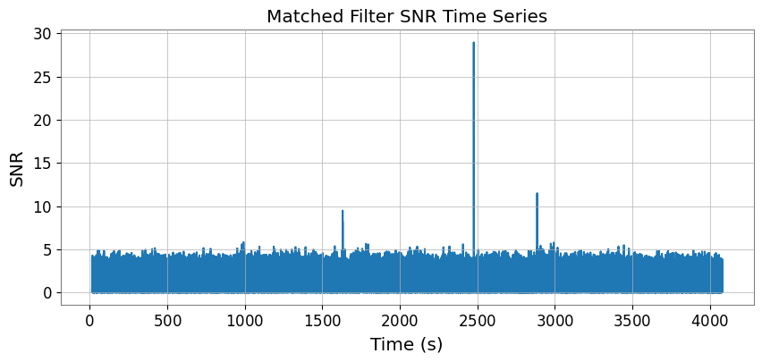
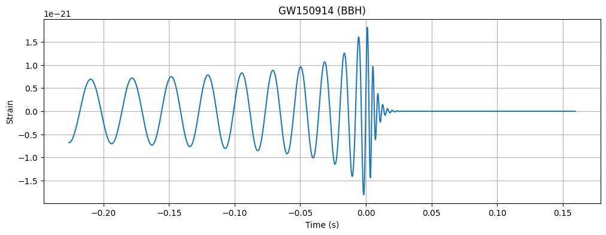
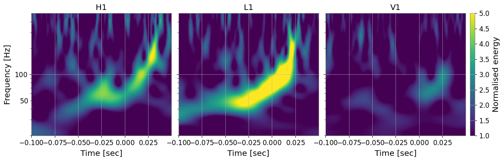
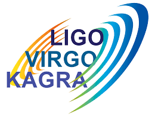

# Gravitational Wave Open Data Workshop 2026


<p align="center">
  
  
  
  
  
</p>

<p align="center">
  <strong>A complete hands-on journey through gravitational-wave data analysis using open LIGO/Virgo data.</strong>
</p>

<p align="center">
  From raw detector strain to event detection, parameter estimation, and continuous-wave searches.
</p>

---

## Overview

This repository contains completed solutions, analyses, and documentation for the **Gravitational Wave Open Data Workshop (GW-ODW) 2026**.

The workshop covers the full gravitational-wave data analysis pipeline:

- Accessing public detector data from GWOSC
- Generating theoretical waveforms
- Signal processing and noise whitening
- Matched filtering and significance estimation
- Bayesian parameter estimation using Bilby
- Population inference and continuous-wave searches

In addition to the official tutorial notebooks, this repository includes detailed solutions to all four data challenges, along with professional markdown summaries, figures, and interpretations.

---

## Highlights

- Completed **5 core tutorial modules**
- Solved **4 progressively advancing data challenges**
- Performed Bayesian parameter estimation with **Bilby**
- Generated and interpreted **Q-transforms, SNR time series, and posterior predictive checks**
- Detected **merger events and glitches** from continous data
- Explored advanced topics including:
  - `LALInference`
  - Population inference
  - Frequency-Hough continuous-wave searches

---

<p align="center">
  <strong>Run the notebooks interactively in Google Colab</strong><br><br>
  <a href="https://colab.research.google.com/github/rishn/GW-Open-Data-Workshop-2026/blob/main/README.md">
    
  </a>
</p>

---

## Data Challenge

The data challenge synthesizes the concepts introduced in the tutorials and provides end-to-end analysis exercises.

| Challenge | Focus Area | Key Outcome |
|---------:|------------|-------------|
| 1 | Time-frequency analysis | Identified a clear gravitational-wave chirp |
| 2 | Matched filtering | Recovered a weak signal and measured SNR |
| 3 | Multi-detector coincidence | Confirmed the event independently in H1 and L1 |
| 4 | Event search and parameter estimation | Detected multiple events, classified glitches, and inferred source masses |

### Challenge 1 — Chirp Detection

<p align="center">
  
</p>
A Q-transform spectrogram was used to identify the characteristic chirp signature of a compact binary merger.

### Challenge 2 — Matched Filter SNR

<p align="center">
  
</p>
Matched filtering recovered a weak signal buried in detector noise and produced a clear SNR peak at the merger time.

### Challenge 3 — Multi-Detector Coincidence

<p align="center">
  
</p>

Matched filtering was performed independently on Hanford (H1) and Livingston (L1) data. Consistent SNR peaks at the same coalescence time confirmed the astrophysical origin of the signal.

### Challenge 4 — Event Search, Glitch Detection, and Parameter Estimation

#### Candidate Event Detection

<p align="center">
  
</p>

A long-duration dataset was scanned to identify candidate events. The earliest confirmed detection near 826.43 s was selected for Bayesian parameter estimation.

#### Glitch Detection

*Representative Instrumental Glitch — Koi Fish*
<p align="center">
  
</p>

As an additional analysis, representative detector artifacts were visually compared with the Gravity Spy taxonomy and assigned likely morphological classifications.

*Example classifications:*

- Koi Fish
- Blip
- Tomte
- Fast Scattering
- Whistle
- Low Frequency Blip
- Paired Doves

#### Parameter Estimation Result

For the earliest confirmed event, Bayesian inference yielded component masses with a 90% credible interval of

$$
28.70 \le m \le 28.76\,M_\odot
$$

consistent with an equal-mass binary black hole merger.

---

## Tutorials

The workshop tutorials provide the theoretical and computational foundation for the challenge analyses.

| Tutorial | Topic |
|------|------|
| 1 | Accessing Open Data |
| 2 | Generating Waveforms |
| 3 | Signal Processing |
| 4 | Searches |
| 5 | Parameter Estimation |

### Example Outputs

#### Binary Black Hole Waveform

<p align="center">
  
</p>

#### Q-Transform of a Gravitational-Wave Event

<p align="center">
  
</p>

#### Posterior Predictive Check

<p align="center">
  
</p>

---

## Extension Topics

Optional advanced notebooks covering research-grade methods:

- Parameter estimation with `LALInference`
- Hierarchical population inference
- Continuous-wave searches using the Frequency-Hough transform

### Frequency-Hough Map

<p align="center">
  
</p>

---

## Repository Structure

```text
tutorials/        # Core workshop tutorials
data_challenge/   # Completed challenge solutions
assets/           # Shared images and graphics
```

---

## Running the Notebooks

The easiest way to explore the notebooks is through Google Colab.

> Click the **Open in Colab** badge at the top of this README to launch the repository in a hosted environment with no local setup required.

### Local Setup (Optional)

```bash
pip install -r env/requirements.txt
```
or
```bash
conda env create -f env/environment.yml
conda activate gw-odw
```
---

## Technologies Used

- Python
- NumPy
- SciPy
- Matplotlib
- GWpy
- PyCBC
- Bilby
- PESummary
- LALSuite
- PyHough

---

## Official Workshop Repository

The original workshop materials and course content are available at:

- 🌐 Workshop Portal: [GW Open Data Workshop 2026](https://gw-odw.thinkific.com/courses/take/odw2026/texts/70856330-welcome)
- 💻 Official Repository: [gw-odw/odw: Materials from GW Open Data Workshop](https://github.com/gw-odw/odw)

---

## Acknowledgements

This work is based on the Gravitational Wave Open Data Workshop organized by the LIGO–Virgo–KAGRA Collaboration and the Gravitational Wave Open Science Center (GWOSC).

<p align="center">
  
</p>

