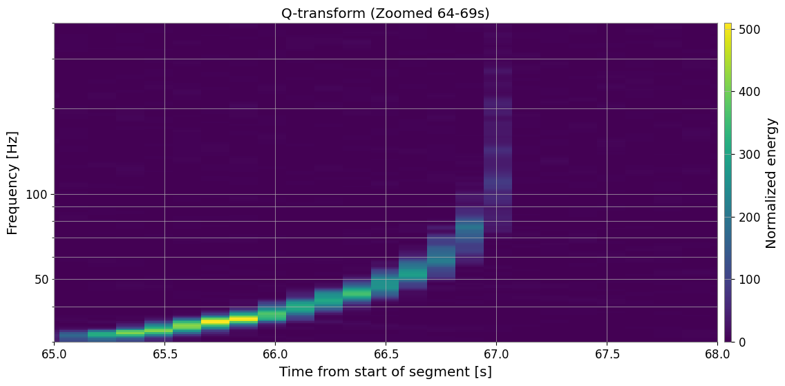

# GW-ODW Data Challenge 1 — Detecting a Gravitational-Wave Chirp (Novice)


<p align="center">
  <strong>Identify a compact binary coalescence signal using time-domain analysis and Q-transform visualizations.</strong>
</p>

---

## Overview

This challenge introduces the fundamental workflow used to detect gravitational-wave signals in open detector data.

Using the `H1:CHALLENGE1` strain channel, the notebook walks through the process of:

- Loading a frame (`.gwf`) file.
- Inspecting metadata such as sampling rate and duration.
- Plotting the strain time series.
- Zooming into regions of interest.
- Generating a Q-transform spectrogram.
- Locating the merger time of a binary black hole event.

The goal is to recognize the characteristic chirp signature produced by two inspiraling black holes.

---

## Notebook

### `./GW_ODW_Data_Challenge_1.ipynb`

<p>
  <a href="https://colab.research.google.com/github/rishn/GW-Open-Data-Workshop/blob/main/data_challenge/challenge_1/GW_ODW_Data_Challenge_1.ipynb">
    
  </a>
</p>

---

## Challenge Objective

Analyze the provided strain data and determine:

1. Whether a gravitational-wave signal is present.
2. The approximate merger time.
3. The visual evidence supporting the detection.

The signal is embedded in realistic detector noise and must be identified through a combination of time-domain and time-frequency analysis.

---

## Analysis Workflow

### 1. Load the Challenge Data

The frame file is loaded using `gwpy.timeseries.TimeSeries`, providing access to the gravitational-wave strain and associated metadata.

### 2. Inspect the Time Series

The full strain segment is plotted to identify any prominent transient features.

### 3. Zoom Around the Candidate Event

A narrower time window is examined to reveal the increasing oscillation amplitude characteristic of a merger.

### 4. Generate a Q-Transform

A Q-transform spectrogram is computed to visualize the signal in the time-frequency domain.

### 5. Estimate the Merger Time

The peak amplitude and brightest portion of the Q-transform are used to estimate the coalescence time.

---

## Results

A clear binary black hole chirp is detected in the strain data.

<p align="center">
  
</p>

### Estimated Merger Time

The merger occurs at approximately:

**67 seconds from the start of the data segment**

### Observational Features

- Rapid increase in frequency.
- Increasing amplitude toward merger.
- Distinct upward-sweeping chirp in the Q-transform.
- Strong, short-duration transient inconsistent with stationary noise.

---

## Challenge Output

The notebook produces:

- Full time-domain strain plot.
- Zoomed view of the chirp.
- Q-transform spectrogram.
- Estimated merger time.

These outputs provide strong visual confirmation of the gravitational-wave signal.

---

## Scientific Interpretation

The detected chirp is consistent with a compact binary coalescence:

1. Two black holes orbit one another.
2. Gravitational radiation removes orbital energy.
3. The orbital frequency increases.
4. The emitted signal rises in both amplitude and frequency.
5. The system merges, producing the strongest signal.

This event morphology is the defining signature of a binary black hole merger.

---

## Tools and Libraries

- Python
- NumPy
- Matplotlib
- GWpy
- LIGO Open Data

---

## Files

```text
data_challenge/
└── challenge_1/
    ├── GW_ODW_Data_Challenge_1.ipynb
    ├── challenge_1.md
    └── merger.png
```
---

### Learning Outcomes

After completing this challenge, you will be able to:

- Load gravitational-wave strain data.
- Identify transient chirp signals.
- Use Q-transforms for time-frequency analysis.
- Estimate merger times directly from detector data.

---

### References
- https://gwosc.org/
- https://gwpy.github.io/docs/stable/