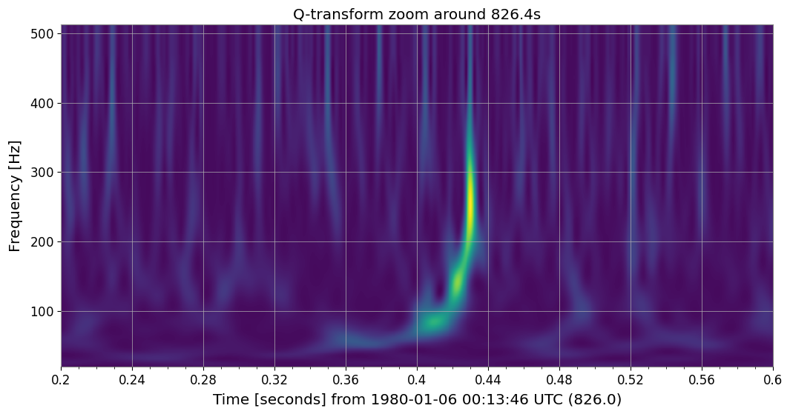
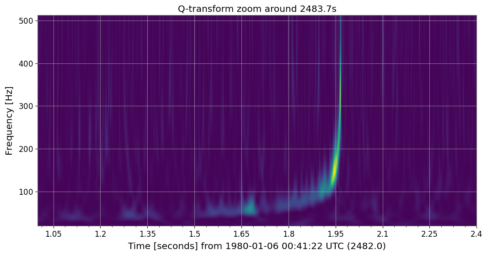
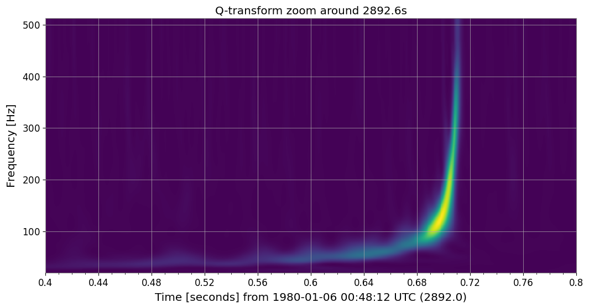
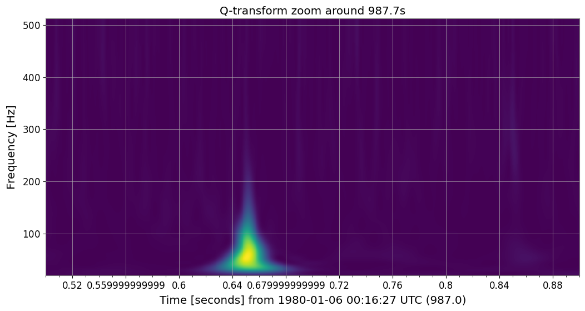
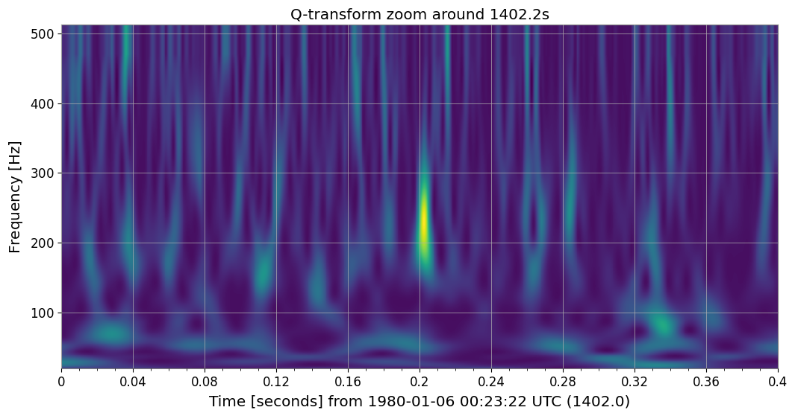
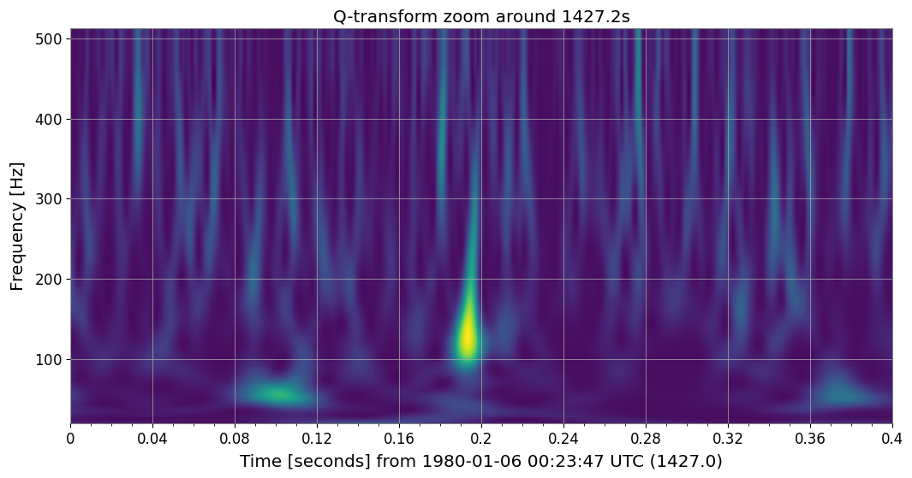
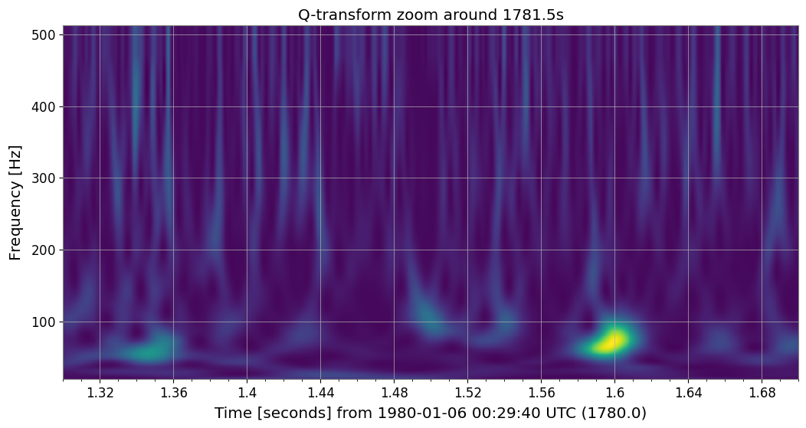
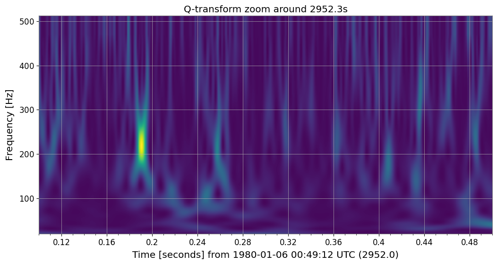
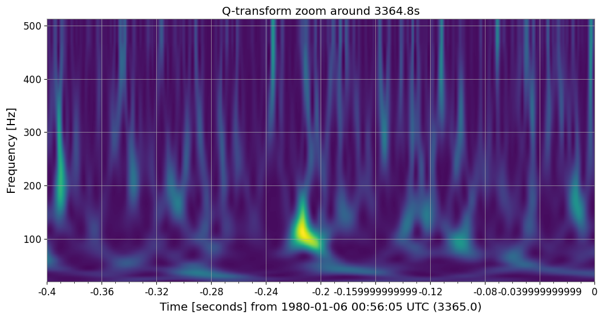
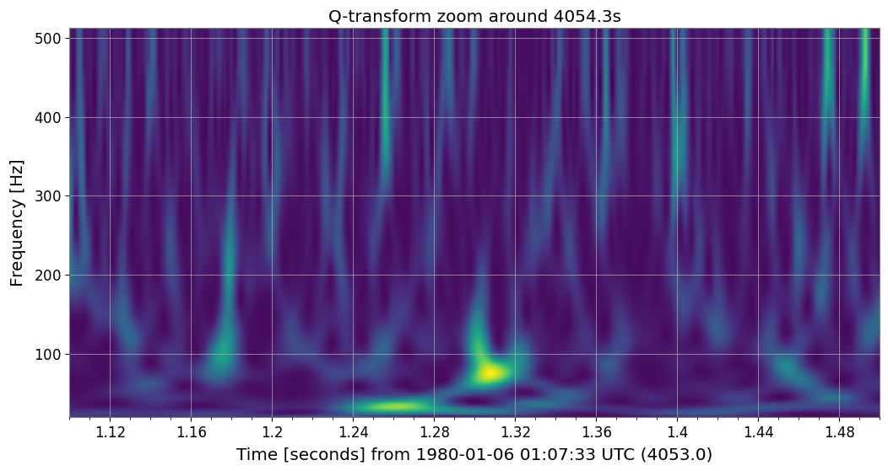

# GW-ODW Data Challenge 4 — Multi-Event Detection and Parameter Estimation (Advanced)

<p align="center">
  <strong>Search for multiple events, classify detector glitches, and infer source properties.</strong>
</p>

---

## Overview

Challenge 4 brings together the core techniques developed throughout the workshop  into a complete gravitational-wave analysis workflow over data containing multiple astrophysical signals and instrumental glitches.

Using data from the Hanford (H1) and Livingston (L1) detectors, this notebook demonstrates how to:

- Scan the strain data for candidate transients.
- Distinguish genuine gravitational-wave events from glitches.
- Confirm coincident detections across detectors.
- Estimate signal parameters using matched filtering.
- Perform Bayesian parameter estimation on confirmed events.

This challenge closely mirrors the real-world workflow used in gravitational-wave searches.

---

## Notebook

**Notebook:** `GW_ODW_Data_Challenge_4.ipynb`

**Path:** `data_challenge/challenge_4/GW_ODW_Data_Challenge_4.ipynb`

---

## Challenge Objective

Analyze a multi-hour dataset and:

1. Identify candidate gravitational-wave events.
2. Reject noise transients and instrumental glitches.
3. Confirm coincident events in both detectors.
4. Estimate source properties for a selected event.

---

## Analysis Workflow

### 1. Load the Challenge Data

The challenge data are loaded from frame files for both H1 and L1.

### 2. Scan for Candidate Events

The strain is inspected using time-domain plots and Q-transform spectrograms to identify transient features.

### 3. Classify Events and Glitches

Candidates exhibiting chirp-like morphology and coincident detections in both detectors are classified as astrophysical events, while non-coincident or irregular transients are labeled as glitches.

### 4. Estimate Signal Parameters

Matched filtering is used to estimate merger times and approximate binary masses.

### 5. Perform Bayesian Parameter Estimation

A Bilby-based parameter estimation analysis is run on a confirmed event to infer posterior distributions for source parameters.

---

## Results

### Confirmed Gravitational-Wave Events

The following events were identified and verified as compact binary coalescence candidates:

- **826.43 s**
- **1101.43 s**
- **1638.16 s**
- **2483.96 s**
- **2892.71 s**
- **3219.19 s**

### Representative Event Visualizations

<p align="center">
  
</p>

<p align="center">
  
</p>

<p align="center">
  
</p>

### Example Instrumental Glitches

Several transient features were identified as detector artifacts rather than astrophysical signals.

#### Glitch at 987.7 s — Koi Fish
A transient with a bright low-frequency core and a narrow upward plume, resembling the characteristic asymmetric morphology of a Koi Fish glitch.

<p align="center">
  
</p>

#### Glitch at 1402.2 s — Blip
A short-duration broadband transient appearing as a compact vertical burst in the time-frequency plane.

<p align="center">
  
</p>

#### Glitch at 1427.2 s — Tomte
A teardrop-shaped low-frequency feature with a pronounced upward extension, consistent with the Tomte class.

<p align="center">
  
</p>

#### Glitch at 1781.5 s — Fast Scattering
A curved low-frequency structure suggestive of scattered-light modulation.

<p align="center">
  
</p>

#### Glitch at 2952.2 s — Whistle
A narrow, high-Q vertical feature concentrated near $\sim 200$ Hz.

<p align="center">
  
</p>

#### Glitch at 3364.8 s — Low Frequency Blip
A compact bulb-like transient centered below $\sim 150$ Hz.

<p align="center">
  
</p>

#### Glitch at 4054.3 s — Paired Doves
Two adjacent low-frequency lobes forming the distinctive double-wing morphology of the Paired Doves class.

<p align="center">
  
</p>

### Parameter Estimation

Bayesian parameter estimation was performed on the earliest confirmed event near **826.43 s** using Bilby.

The posterior distribution for the component mass yielded the following 90% credible interval:

$$
m = 28.70\text{–}28.76\,M_\odot
$$

This result is consistent with a binary black hole system containing nearly equal-mass components of approximately $29\,M_\odot$ each.

---

## Challenge Output

The notebook produces:

- Candidate event list.
- Q-transform visualizations.
- Matched-filter SNR results.
- Event versus glitch classifications.
- Posterior distributions from parameter estimation.

---

## Scientific Interpretation

A genuine gravitational-wave event should exhibit:

- Chirp morphology in the time-frequency plane.
- Coincident detection in multiple detectors.
- High matched-filter SNR.
- Consistency with compact binary waveform models.

Instrumental glitches often produce transient excess power but lack one or more of these characteristics.

---

## Tools and Libraries

- Python
- NumPy
- Matplotlib
- GWpy
- PyCBC
- Bilby
- LIGO Open Data

---

## Files

```text
data_challenge/
└── challenge_4/
    ├── GW_ODW_Data_Challenge_4.ipynb
    ├── challenge_4.md
    |── event_826.png
    |── event_1101.png
    |── event_1638.png
    |── event_2484.png
    |── event_2893.png
    |── event_3219.png
    |── glitch_988_koi_fish.png
    |── glitch_1402_blip.png
    |── glitch_1427_tomte.png
    |── glitch_1782_fast_scattering.png
    |── glitch_2952_whistle.png
    |── glitch_3365_low_freq_blip.png
    └── glitch_4054_paired_doves.png
```
---

### Learning Outcomes

After completing this challenge, you will be able to:

- Search long-duration data for transient candidates.
- Differentiate astrophysical events from glitches.
- Validate coincident detections.
- Apply matched filtering and parameter estimation.
- Interpret posterior distributions for source properties.

---

### References
- https://gwosc.org/
- https://gwpy.github.io/docs/stable/
- https://pycbc.org/
- https://bilby-dev.github.io/bilby/
