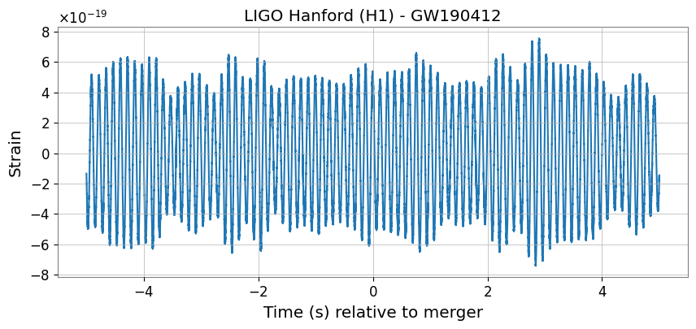
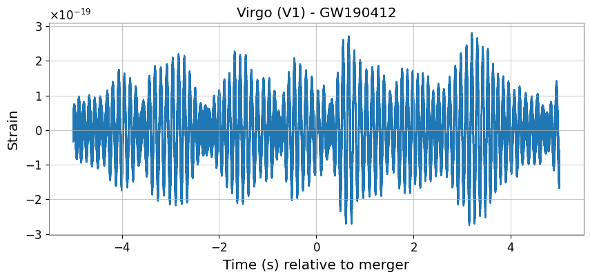

# Tutorial 1 — Accessing Open Data

  <strong>Learn how to discover, download, and load publicly available gravitational-wave data using GWOSC, GWpy, and PyCBC.</strong>

## Overview

This tutorial introduces the tools and workflows used to access gravitational-wave open data from the Gravitational Wave Open Science Center (GWOSC).

The tutorial is divided into two notebooks. The first focuses on exploring the GWOSC archive and understanding the available datasets, while the second demonstrates how to load detector strain data into Python and visualize it using `GWpy` and `PyCBC`.

The objective is to build familiarity with the structure, metadata, and basic handling of open detector data before proceeding to signal analysis and detection.

## Notebooks

### `./GW_ODW_Tuto_1.1_Discovering_Open_Data.ipynb`
Explore the GWOSC portal, identify relevant datasets, and understand the metadata associated with gravitational-wave observations.

  

### `./GW_ODW_Tuto_1.2_Accessing_Open_Data_with_GWpy_and_PyCBC.ipynb`
Download frame files, load detector strain channels, and visualize time-series data using Python.

  

## Tutorial Objectives

By completing this tutorial, you will learn how to:

1. Navigate the GWOSC archive.
2. Download gravitational-wave frame files.
3. Load strain data using `GWpy` and `PyCBC`.
4. Inspect metadata such as sampling rate and duration.
5. Visualize detector strain time series.

## Tutorial 1.1 — Discovering Open Data

### Workflow Summary

1. Explore the GWOSC website and event catalogs.
2. Identify available data products for published events.
3. Examine metadata including detector names, GPS times, and data formats.
4. Locate download links for frame files and auxiliary products.

### Results

By the end of this notebook, you will understand:

- How gravitational-wave datasets are organized in GWOSC.
- Which files are required for scientific analysis.
- How event metadata are structured and documented.

## Tutorial 1.2 — Accessing Open Data with GWpy and PyCBC

### Workflow Summary

1. Download example frame (`.gwf`) files.
2. Load detector strain data into Python.
3. Inspect the start time, duration, and sample rate.
4. Plot the time-domain strain from multiple detectors.

### Results

The tutorial successfully loads and visualizes detector strain data.

#### Hanford (H1) Strain Data

  

#### Virgo (V1) Strain Data

  

### Key Observations

- Open data can be loaded directly into Python.
- `GWpy` and `PyCBC` provide convenient interfaces for reading frame files.
- The strain data are dominated by detector noise, with occasional transient features.

## Tools and Libraries

- Python
- NumPy
- Matplotlib
- GWpy
- PyCBC
- GWOSC Open Data

## Learning Outcomes

After completing this tutorial, you will be able to:

- Locate and download gravitational-wave open data.
- Load detector strain channels into Python.
- Inspect time-series metadata.
- Visualize and interpret raw detector strain.
- Prepare data for subsequent signal processing.

## References

- https://gwosc.org/
- https://gwpy.github.io/docs/stable/
- https://pycbc.org/
