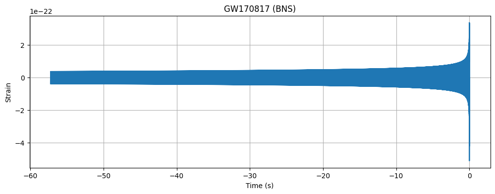

# Tutorial 2 — Generating Gravitational-Wave Waveforms

  <strong>Generate and compare theoretical gravitational-wave signals from compact binary systems.</strong>

## Overview

This tutorial introduces waveform modeling, a central component of gravitational-wave data analysis.

Using `PyCBC`, you will generate theoretical gravitational-wave signals for binary black hole and binary neutron star systems, compare their time-domain and frequency-domain representations, and study how waveform morphology depends on the masses of the compact objects.

The tutorial also includes optional exploratory exercises, such as estimating the time remaining until merger from different starting frequencies (30 Hz, 10 Hz, 5 Hz, and the LISA band at 20 mHz), illustrating how long sources remain observable as detector sensitivity improves.

The objective is to understand how source parameters shape the templates used for matched filtering and parameter estimation.

## Notebooks

### `./GW_ODW_Tuto_2.1_Generating_waveforms.ipynb`
Generate and visualize gravitational-wave templates for a variety of compact binary systems.

  

### `./GW_ODW_Tuto_2_Extracurricular_topics.ipynb`
Optional extensions exploring additional waveform concepts and advanced topics.

  

## Tutorial Objectives

By completing this tutorial, you will learn how to:

1. Generate time-domain and frequency-domain gravitational-wave templates.
2. Compare waveforms from binary black hole and binary neutron star systems.
3. Study how component masses affect waveform duration and frequency evolution.
4. Relate detector sensitivity bands to the observable lifetime of inspiral signals.
5. Prepare waveform templates for matched filtering analyses.

## Tutorial 2.1 — Generating Waveforms

### Workflow Summary

1. Specify binary component masses and waveform parameters.
2. Generate time-domain waveforms using `get_td_waveform()`.
3. Visualize waveform amplitude as a function of time.
4. Compute frequency-domain templates.
5. Compare waveforms for systems with different masses.

### Results

The notebook demonstrates the distinct morphology of gravitational-wave signals from different compact binaries.

#### GW150914-like Binary Black Hole Waveform

  

#### GW170817-like Binary Neutron Star Waveform

  

### Key Observations

- Binary black hole mergers produce short-duration, high-amplitude chirps.
- Binary neutron star systems remain in band much longer before merger.
- Lower-mass systems evolve more slowly and contain many more waveform cycles.
- Waveform templates are the theoretical signals used in matched filtering searches.

## Tutorial 2.2 — Extracurricular Topics

### Workflow Summary

1. Compute the chirp mass for representative binary systems.
2. Use the leading-order inspiral relation to estimate time-to-merger from different starting frequencies.
3. Compare binary black hole and binary neutron star systems.
4. Extend the analysis to millihertz frequencies relevant to LISA.

### Results

The optional analysis shows how dramatically the observable inspiral duration increases as detectors gain access to lower frequencies.

#### Example Time-to-Merger Estimates

| System | 30 Hz | 10 Hz | 5 Hz | 20 mHz |
|------|------:|------:|------:|------:|
| GW150914-like Binary Black Hole | 0.28 s | 5.33 s | 33.83 s | 2.66 years |
| GW170817-like Binary Neutron Star | 56.1 s | 17.5 min | 1.85 hr | 524 years |

### Key Observations

- Massive black hole binaries merge rapidly once they enter the LIGO band.
- Binary neutron stars remain observable for much longer.
- Lower-frequency sensitivity greatly increases the available observation time.
- Space-based detectors can observe inspiraling systems years to centuries before merger.

## References

- https://pycbc.org/
- https://gwosc.org/
