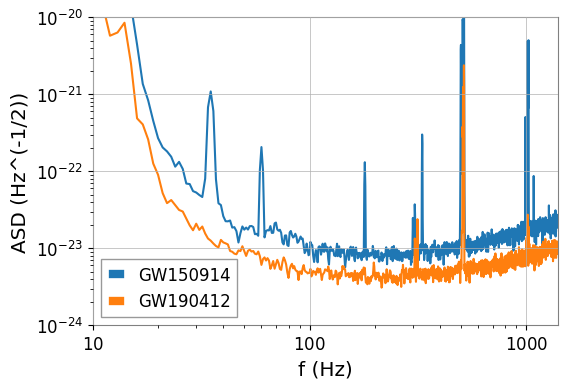
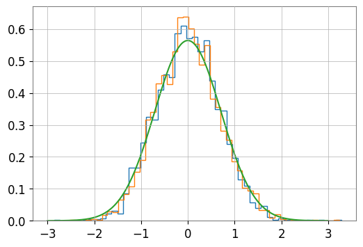

# Tutorial 3 — Signal Processing

  <strong>Transform raw detector strain into analysis-ready data using Fourier methods, noise characterization, and time-frequency visualizations.</strong>

---

## Overview

This tutorial introduces the core signal-processing techniques used in gravitational-wave data analysis.

Across three notebooks, you will explore Fourier transforms, estimate the detector noise Power Spectral Density (PSD), whiten and bandpass the data, and generate spectrograms and Q-transforms to reveal gravitational-wave signals in noisy strain measurements.

The objective is to understand how detector noise is characterized and suppressed so that astrophysical signals become clearly visible.

---

## Notebooks

### `./GW_ODW_Tuto_3.1_Fourier_Transforms.ipynb`
Introduces discrete Fourier transforms and the relationship between time-domain and frequency-domain representations.

  

### `./GW_ODW_Tuto_3.2_Estimating_the_noise_PSD_and_whitening_band_passing_data.ipynb`
Covers PSD estimation, whitening, Gaussianity checks, and bandpass filtering.

  

### `./GW_ODW_Tuto_3.3_Spectrograms_&_Q_transforms.ipynb`
Demonstrates spectrogram and Q-transform visualizations for identifying gravitational-wave signals and detector artifacts.

  

---

## Tutorial Objectives

By completing this tutorial, you will learn how to:

1. Transform data between the time and frequency domains.
2. Estimate the detector noise Power Spectral Density.
3. Whiten and bandpass strain data.
4. Verify the statistical properties of whitened noise.
5. Generate spectrograms and Q-transforms.

---

## Tutorial 3.1 — Fourier Transforms

### Workflow Summary

1. Construct simple sinusoidal signals.
2. Compute their discrete Fourier transforms.
3. Identify dominant frequency components.
4. Relate time-domain oscillations to frequency-domain peaks.

### Results

This notebook demonstrates how periodic signals are decomposed into their constituent frequencies and establishes the mathematical foundation for PSD estimation and matched filtering.

---

## Tutorial 3.2 — PSD Estimation, Whitening, and Bandpass Filtering

### Workflow Summary

1. Estimate the detector Amplitude Spectral Density (ASD).
2. Compute the noise Power Spectral Density (PSD).
3. Whiten the strain data.
4. Apply bandpass filtering.
5. Verify that the whitened data are approximately Gaussian.

### Results

#### Amplitude Spectral Density

  

#### Histogram of Whitened Data

  

### Key Observations

- The ASD highlights frequency regions where detector noise is strongest.
- Whitening flattens the noise spectrum.
- The real and imaginary components of the whitened data are approximately Gaussian with standard deviation close to unity.

---

## Tutorial 3.3 — Spectrograms and Q-Transforms

### Workflow Summary

1. Generate standard spectrograms.
2. Compute a Q-transform.
3. Zoom into a candidate event.
4. Compare the time-frequency evolution of the signal.

### Results

#### Gravitational-Wave Event in a Q-Transform

  

### Key Observations

- The gravitational-wave signal appears as an upward-sweeping chirp.
- Q-transforms provide better resolution for compact transient signals than standard spectrograms.
- Time-frequency representations are powerful tools for distinguishing astrophysical events from glitches.

---

## Tools and Libraries

- Python
- NumPy
- Matplotlib
- SciPy
- GWpy
- PyCBC

---

## Learning Outcomes

After completing this tutorial, you will be able to:

- Interpret Fourier transforms of time-domain signals.
- Estimate detector noise spectra.
- Whiten and bandpass gravitational-wave strain data.
- Verify Gaussian noise assumptions.
- Generate spectrograms and Q-transforms to identify transient signals.

---

## References

- https://gwosc.org/
- https://gwpy.github.io/docs/stable/
- https://pycbc.org/
- https://docs.scipy.org/
