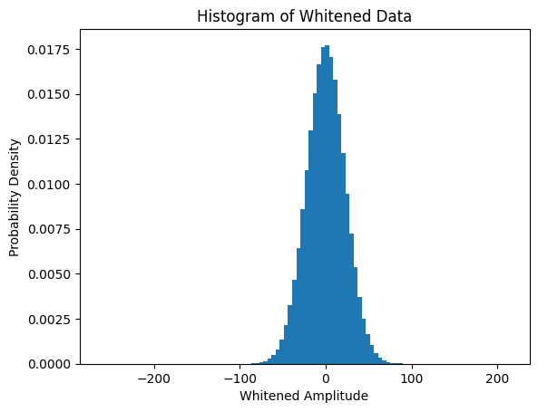
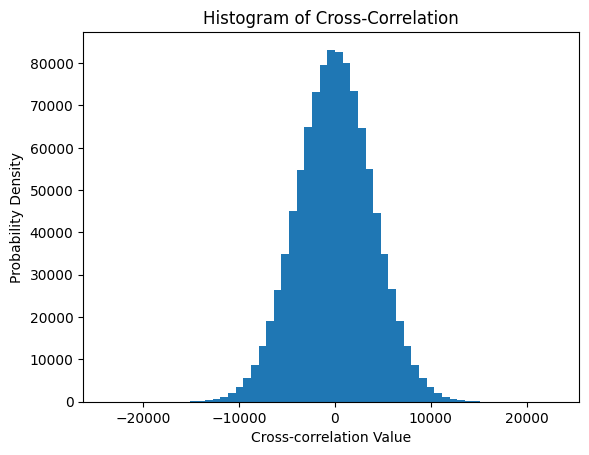
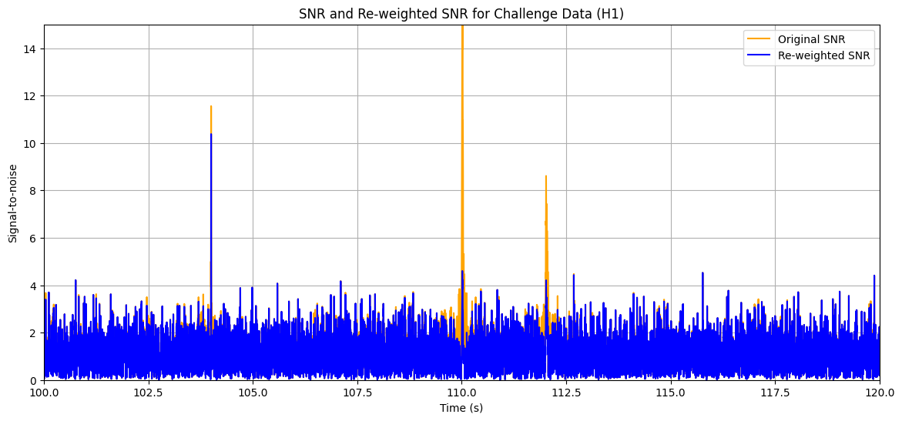

# Tutorial 4 — Searches

  <strong>Detect gravitational-wave signals using matched filtering, signal consistency tests, and statistical significance estimation.</strong>

## Overview

This tutorial introduces the core techniques used to search detector data for modeled gravitational-wave signals.

Across three notebooks, you will build the matched-filter formalism from first principles, apply it to realistic detector data, and evaluate the significance of candidate events using signal-consistency tests and background noise statistics.

The objective is to understand how weak astrophysical signals are identified and distinguished from random noise fluctuations.

## Notebooks

### `./GW_ODW_Tuto_4.1_Matched_filtering_introduction.ipynb`
Introduces cross-correlation, optimal filtering, and the statistical interpretation of matched filtering.

  

### `./GW_ODW_Tuto_4.2_Matched_Filtering_In_action.ipynb`
Applies matched filtering to detector data using realistic waveform templates and noise models.

  

### `./GW_ODW_Tuto_4.3_Signal_consistency_and_significance.ipynb`
Evaluates candidate events using chi-squared consistency tests and significance estimates.

  

## Tutorial Objectives

By completing this tutorial, you will learn how to:

1. Understand the statistical foundations of matched filtering.
2. Compute matched-filter signal-to-noise ratio (SNR) time series.
3. Identify candidate events from SNR peaks.
4. Apply signal-consistency tests to reject noise transients.
5. Estimate the significance of a detection.

## Tutorial 4.1 — Matched Filtering Introduction

### Workflow Summary

1. Generate a synthetic signal embedded in Gaussian noise.
2. Whiten the data and verify the noise distribution.
3. Compute the cross-correlation time series.
4. Identify the peak correlation and estimate the SNR.

### Results

#### Histogram of Whitened Data

  

#### Histogram of Cross-Correlation Time Series

  

### Key Observations

- Whitening transforms the noise into an approximately standard normal distribution.
- Cross-correlation produces a prominent peak when the template aligns with the signal.
- The peak amplitude relative to the noise standard deviation defines the matched-filter SNR.

## Tutorial 4.2 — Matched Filtering in Action

### Workflow Summary

1. Generate a waveform template for a compact binary merger.
2. Estimate the detector PSD.
3. Match the template to the data.
4. Compute and analyze the SNR time series.

### Results

The matched-filter output reveals a clear SNR peak at the signal time, demonstrating the effectiveness of template-based searches in realistic detector noise.

## Tutorial 4.3 — Signal Consistency and Significance

### Workflow Summary

1. Compute the matched-filter SNR.
2. Apply a chi-squared signal-consistency test.
3. Reweight the SNR using the chi-squared statistic.
4. Estimate the significance of the candidate event.

### Results

#### Reweighted SNR Time Series

  

### Key Observations

- Genuine signals produce both high SNR and good template consistency.
- Noise transients may produce high SNR but fail the chi-squared test.
- Reweighted SNR provides a more robust detection statistic.

## Tools and Libraries

- Python
- NumPy
- Matplotlib
- SciPy
- PyCBC
- GWpy

## Learning Outcomes

After completing this tutorial, you will be able to:

- Derive the matched-filter concept from cross-correlation.
- Compute SNR time series from detector data.
- Identify candidate events from SNR peaks.
- Apply chi-squared consistency tests.
- Evaluate the statistical significance of detections.

## References

- https://gwosc.org/
- https://pycbc.org/
- https://gwpy.github.io/docs/stable/
