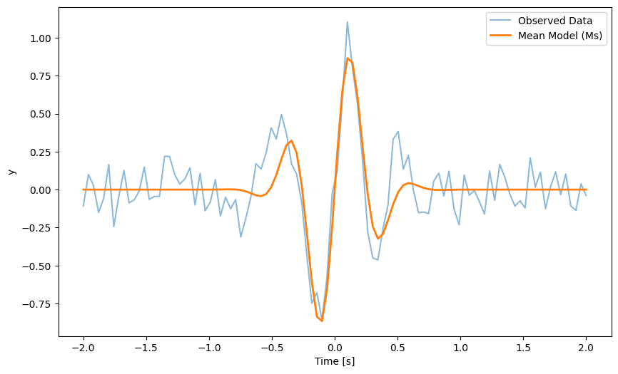

# Tutorial 5 — Parameter Estimation

  <strong>Infer source properties by comparing gravitational-wave data with theoretical models using Bayesian inference.</strong>

---

## Overview

This tutorial introduces Bayesian parameter estimation, the framework used to infer the physical properties of gravitational-wave sources.

Across three notebooks, you will build intuition using a simple toy model, perform parameter estimation for compact binary mergers with `Bilby`, and explore published posterior samples from real gravitational-wave events.

The objective is to understand how posterior distributions, credible intervals, and model comparisons are used to extract astrophysical information from detector data.

---

## Notebooks

### `GW_ODW_Tuto_5.1_Introduction_to_parameter_estimation.ipynb`
Introduces Bayesian inference concepts using a damped sinusoid toy model.

### `GW_ODW_Tuto_5.2_Parameter_estimation_for_compact_object_mergers.ipynb`
Performs parameter estimation for binary black hole mergers using gravitational-wave data.

### `GW_ODW_Tuto_5.3_Discovering_and_using_published_posterior_samples.ipynb`
Explores publicly released posterior samples and compares inferred source properties.

---

## Tutorial Objectives

By completing this tutorial, you will learn how to:

1. Construct likelihood functions and prior distributions.
2. Sample posterior distributions using `Bilby`.
3. Interpret corner plots and posterior predictive checks.
4. Compare competing models using Bayes factors.
5. Analyze published posterior samples from real events.

---

## Tutorial 5.1 — Introduction to Parameter Estimation

### Workflow Summary

1. Define a simple damped sinusoid model.
2. Construct a Gaussian likelihood.
3. Run MCMC and nested sampling.
4. Compare competing models using Bayes factors.
5. Perform posterior predictive checks.

### Results

#### Posterior Predictive Check

  

### Key Observations

- Posterior samples quantify uncertainty in model parameters.
- Random posterior draws capture the range of plausible model realizations.
- Bayes factors provide a principled method for model comparison.

---

## Tutorial 5.2 — Parameter Estimation for Compact Object Mergers

### Workflow Summary

1. Define priors for masses, distance, and other source parameters.
2. Construct a gravitational-wave likelihood.
3. Run a reduced `Bilby` analysis.
4. Extract posterior summaries and credible intervals.
5. Visualize parameter correlations using corner plots.

### Results

The analysis yields posterior distributions for source parameters such as component masses, chirp mass, luminosity distance, and inclination angle.

### Key Observations

- The chirp mass is often the best constrained intrinsic parameter.
- Distance and inclination exhibit strong correlations.
- Credible intervals quantify the uncertainty in inferred source properties.

---

## Tutorial 5.3 — Using Published Posterior Samples

### Workflow Summary

1. Load publicly available posterior samples.
2. Extract parameters of interest.
3. Compute summary statistics and credible intervals.
4. Compare results across multiple events.

### Results

Published posterior samples enable rapid exploration of source populations without rerunning computationally intensive analyses.

### Key Observations

- Open posterior datasets provide direct access to LVK parameter-estimation results.
- Derived quantities such as total mass and mass ratio can be computed from samples.
- Population-level trends become accessible through catalog analysis.

---

## Tools and Libraries

- Python
- NumPy
- Matplotlib
- Pandas
- Bilby
- corner
- PESummary

---

## Learning Outcomes

After completing this tutorial, you will be able to:

- Define priors and likelihoods for Bayesian inference.
- Run parameter-estimation analyses using `Bilby`.
- Interpret posterior distributions and credible intervals.
- Compare models using Bayes factors.
- Work with published posterior samples from real gravitational-wave events.

---

## References

- https://bilby-dev.github.io/bilby/
- https://gwosc.org/
- https://lscsoft.docs.ligo.org/pesummary/
