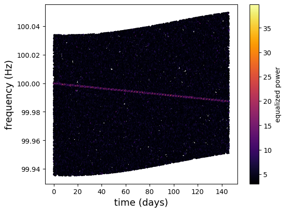
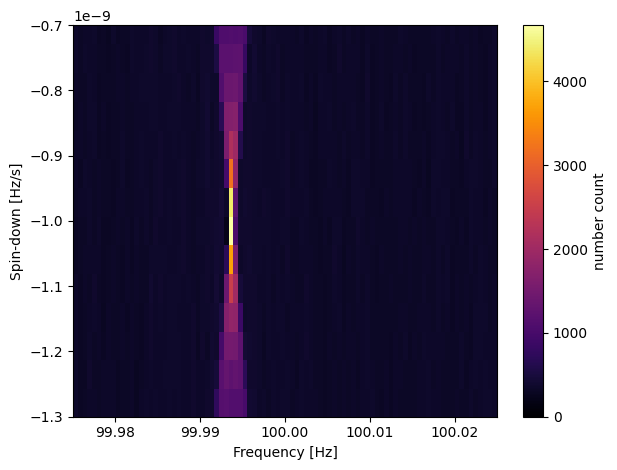

# Extension Topics

  <strong>Explore advanced gravitational-wave analyses beyond the core workshop curriculum.</strong>

---

## Overview

This section collects optional notebooks that extend the workshop into advanced areas of gravitational-wave astronomy.

These notebooks cover production-level parameter estimation with `LALInference`, population inference using published catalogs, and continuous-wave searches based on the Frequency-Hough transform.

The objective is to provide exposure to specialized techniques used in current gravitational-wave research and to highlight directions for deeper exploration.

---

## Notebooks

### `./GW_ODW_Tuto_A.1_Parameter_estimation_for_compact_object_mergers_with_LALInference.ipynb`
Reproduces a production-style parameter estimation workflow using the `LALInference` software employed during the first three observing runs.

  

### `./GW_ODW_Tuto_A.2_population_odw.ipynb`
Introduces hierarchical Bayesian inference for studying the population properties of compact-object mergers.

  

### `./GW_ODW_Tuto_A.3_Continuous_Wave_Searches.ipynb`
Demonstrates the Frequency-Hough method for detecting long-lived, nearly monochromatic gravitational-wave signals.

  

---

## Extension Objectives

By working through these notebooks, you will learn how to:

1. Configure and launch `LALInference` analyses.
2. Analyze posterior samples from multiple events.
3. Infer population-level parameters such as mass distribution slopes.
4. Construct peakmaps from time-frequency data.
5. Detect continuous-wave signals using Hough transforms.

---

## Extension A.1 — Parameter Estimation with LALInference

### Workflow Summary

1. Download open strain data, PSDs, and calibration envelopes.
2. Extract configuration settings from PESummary files.
3. Generate a `LALInference` run script.
4. Launch a production-style parameter-estimation analysis.

### Results

This notebook demonstrates how large-scale Bayesian analyses are configured using the same software framework employed by the LVK Collaboration during O1–O3.

---

## Extension A.2 — Population Inference

### Workflow Summary

1. Load posterior samples from a catalog of gravitational-wave detections.
2. Define a population model for the primary black hole mass distribution.
3. Infer hyperparameters such as the power-law slope $\alpha$ and the minimum mass cutoff $m_{\min}$.
4. Examine how the inferred parameters change when additional events are included.
5. Explore the astrophysical implications of the resulting posterior distributions.

### Results

This notebook demonstrates how multiple detections can be combined to infer the underlying properties of the binary black hole population.

### Key Questions Explored

- What is the preferred value of the power-law slope $\alpha$ governing the black hole mass spectrum?
- What is the inferred lower mass cutoff $m_{\min}$?
- How would the inclusion of an event such as GW190814 affect the estimate of $m_{\min}$?
- How would an excess of low-mass black holes in future observing runs alter the inferred value of $\alpha$?

### Key Observations

- Population inference constrains the distribution of black hole masses rather than individual events.
- Additional detections can significantly shift the inferred hyperparameters.
- Events near the edge of the observed mass distribution strongly influence the estimate of $m_{\min}$.
- A larger-than-expected number of low-mass black holes would favor a shallower mass spectrum.

---

## Extension A.3 — Continuous Wave Searches

### Workflow Summary

1. Generate Short Fourier Transforms (SFTs).
2. Construct a time-frequency peakmap.
3. Apply Doppler corrections for an assumed sky position.
4. Compute the Frequency-Hough transform.
5. Identify candidate peaks in the $(f_0, \dot{f})$ plane.
6. Repeat the analysis with an incorrect sky position to study localization effects.

### Results

#### Doppler-Corrected Peakmap

  

#### Frequency-Hough Map

  

### Key Questions Explored

- Why do both positive and negative slopes appear in the Hough map?
- Why does the signal occupy multiple neighboring pixels around the true $(f_0, \dot{f})$ values?
- How does using an incorrect sky position affect the Doppler-corrected peakmap?
- Why is the Hough number count reduced when the source position is wrong?
- What happens to stationary instrumental lines after Doppler correction?

### Key Observations

- The slope orientation depends on the ordering and sign convention of the spin-down grid.
- Finite frequency and spin-down resolution spreads the signal over several pixels.
- Correct sky localization sharpens the signal track and maximizes the Hough count.
- Incorrect Doppler correction smears the signal, reducing detection significance.
- Stationary noise lines are generally dispersed by Doppler correction, helping distinguish them from true astrophysical signals.

---

## Tools and Libraries

- Python
- NumPy
- Matplotlib
- Bilby
- LALSuite
- PESummary
- PyHough

---

## Learning Outcomes

After completing these extension topics, you will be able to:

- Configure production-style parameter-estimation analyses.
- Perform hierarchical inference on event populations.
- Understand how compact-object population models are constrained.
- Apply the Frequency-Hough method to continuous-wave searches.
- Explore advanced gravitational-wave analysis techniques used in current research.

---

## References

- https://lscsoft.docs.ligo.org/lalsuite/
- https://bilby-dev.github.io/bilby/
- https://lscsoft.docs.ligo.org/pesummary/
- https://gwosc.org/
